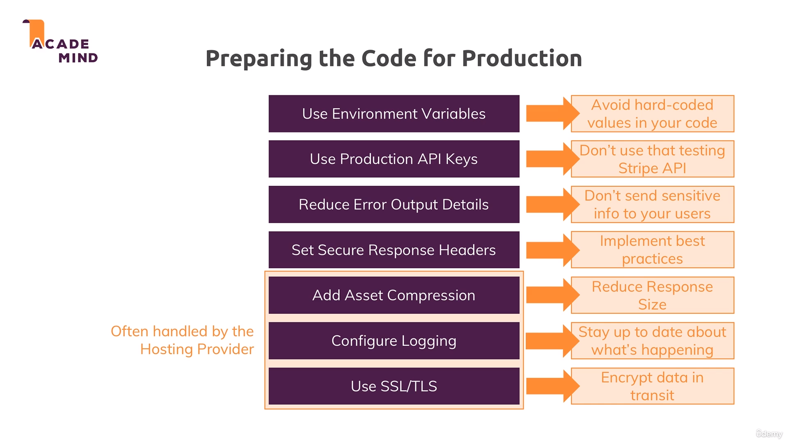
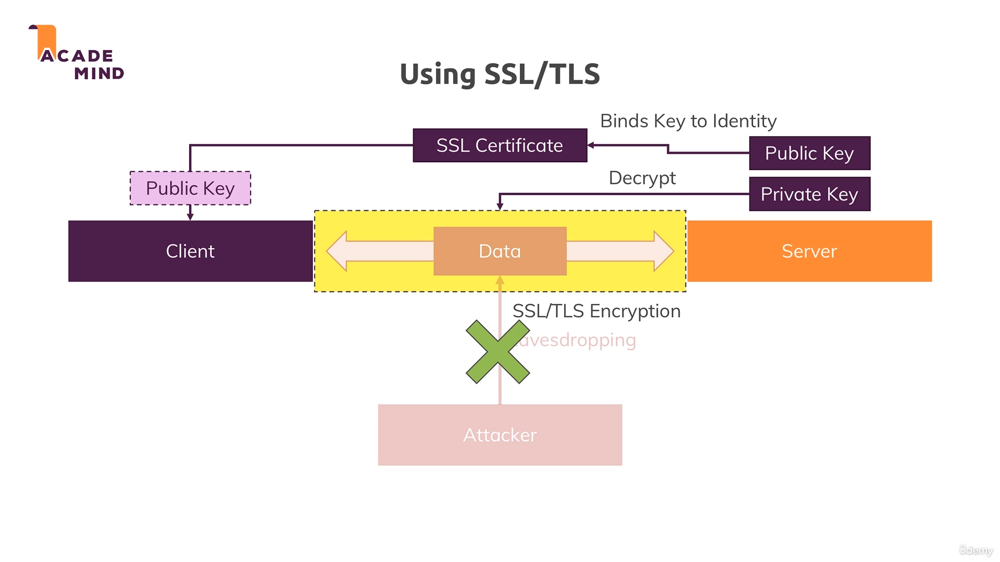
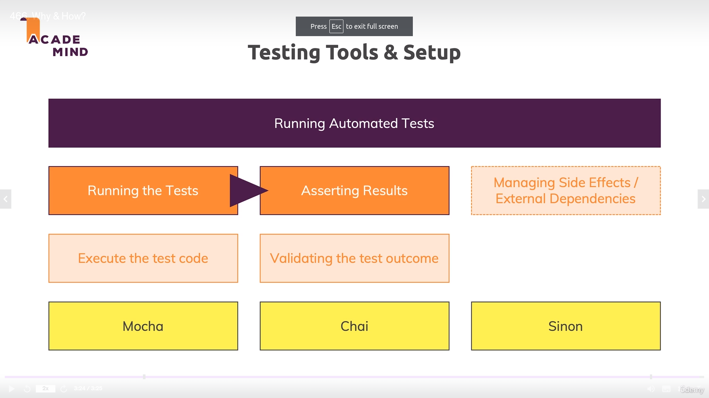
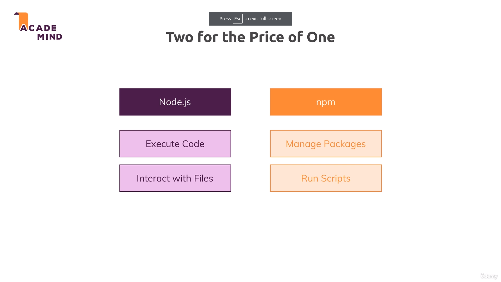
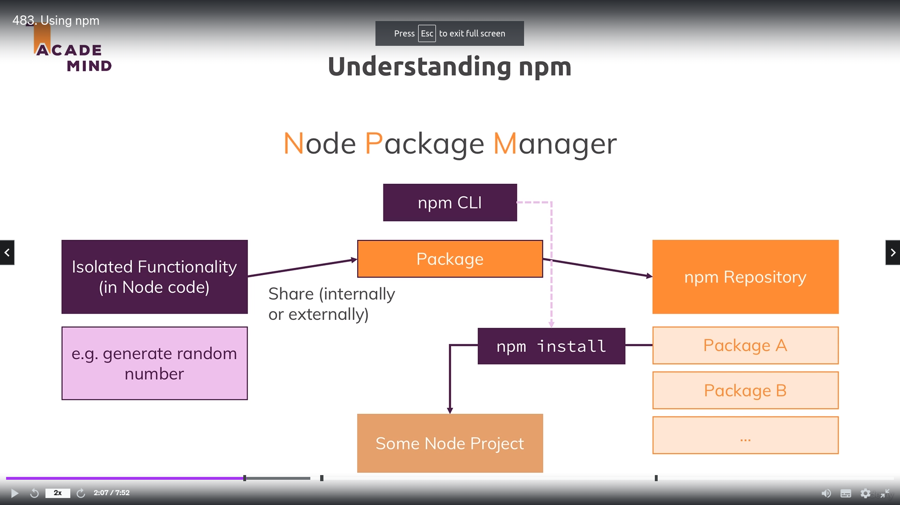
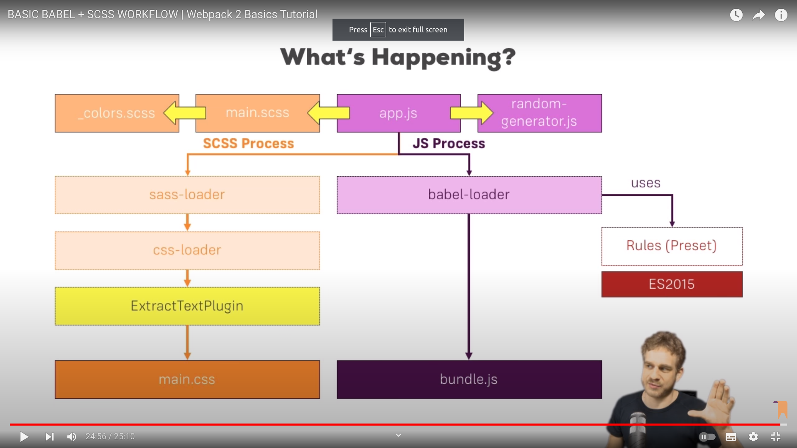

# Master Node JS & Deno.js, build REST APIs with Node.js, GraphQL APIs, add Authentication, use MongoDB, SQL & much more!

- Last but not least - I tweet on @maxedapps and on @academind_real, would love to see you there!
- [Academind](https://academind.com/)

## 02 Creating a NODE Server (02 Understanding Basics)

    - [Readme](./02_Understanding_basics/readme.md)

## 03 Improved Development and debugging

    - [Readme](./03_improved_development_workflow_and_debugging/readme.md)

## 04 Working with Express.JS

## 05 Working with Dynamic Content & Adding Template Engines

## 06 The Model View Controller (MVC) (Section 7, 8, 9) in **06_mvc** folder

## 07, 08, 09 Databases (Sql and No-Sql) (Section 10, 11, 12, 13) in **07_databases** folder

## 10 Sessions, Cookies, Authentication

## 11 REST APIs

## 12 GraphQL

## 13 Deployment

    - 
    - Secure headers with [Helmet](https://www.npmjs.com/package/helmet)
    - [Compression](https://www.npmjs.com/package/compression) to compress assets to make application lightweight and faster
    - [Morgan](https://www.npmjs.com/package/morgan) to request logging on production
        ```
            const accessLogStream = fs.createWriteStream(file, {flags: 'a'})
            app.use(morgan('combined'), {stream: accessLogStream})
        ```
        - [More on Logging](https://blog.risingstack.com/node-js-logging-tutorial/)
    - SSL/TLS
      - 
      - Use of *OPENSSL* on development server to test SSL/TLS but on production, should take certificate for registered authorities
      - [Link](https://medium.com/internshala-tech/adding-self-trusted-ssl-certificate-for-localhost-on-ubuntu-nginx-c66d70b22e4b)
        ```
            https.createServer({key: key, cert: cert}, app).listen(3000)
        ```
    - [Heroku](https://www.heroku.com/)
      - Use of Heroku git to push the code
      - in Settings => Config vars (Add your env variables)
    - Cloud Storage
      - A popular and very efficient + affordable alternative is AWS S3 (Simple Storage Service): https://aws.amazon.com/s3/
      -  You can easily configure multer to store your files there with the help of another package: https://www.npmjs.com/package/multer-s3
      -  To also serve your files, you can use packages like s3-proxy: https://www.npmjs.com/package/s3-proxy
      -  For deleting the files (or interacting with them on your own in general), you'd use the AWS SDK: https://aws.amazon.com/sdk-for-node-js/
    - Useful Links
      - Herokus Docs: https://devcenter.heroku.com/categories/reference
      - Deploying SPAs (like our React App): https://medium.com/@baphemot/understanding-react-deployment-5a717d4378fd
      - Alternative Hosting Providers:
        - Amazon Web Services: https://aws.amazon.com/getting-started/projects/deploy-nodejs-web-app/
        - DigitalOcean: https://www.digitalocean.com/community/tutorials/how-to-set-up-a-node-js-application-for-production-on-ubuntu-16-04

## 14 Testing (done in REST APIs)

    - 

## 15 Node.js as a Build Tool & Using NPM

    - 
    - 
    - Docs
      - [Learn about available versions annotations](https://docs.npmjs.com/misc/semver#versions)
      - [Stackoverflow Post](https://stackoverflow.com/a/25861938)
    - Build Tool
      - [Official npm Docs](https://docs.npmjs.com/)
      - Learn more about [Webpack](https://academind.com/learn/webpack) (a build tool using Node.js)
        - [Webpack Basics](https://academind.com/tutorials/webpack-2-the-basics)
          - Webpack
            - specify entry and output point
          - webpack-dev-server
            - wrapper around webpack which watch changes and build on the fly and store output file in memory server
          - webpack.config.js
            - entry
            - output: {path: path.resolve(__dirname, 'dist'), filename:, publicPath: '/dist' }
            - module: {rules: [{test: /\.css$/, use: ['css-loader', 'style-loader']}]}
            - plugins: [new webpack.optimize.UglifyJsPlugin({})]
          - NPM packages
            - css-loader
            - style-loader
            - sass-loader
            - extract-text-webpack-plugin
            - babel-core
            - bable-loader
            - babel-preset-2015
          - 
          - [HTML + Image Loaders](https://www.youtube.com/watch?v=CzLiXgRUt4g)
          - [Webpack + Mutliple HTML files](https://www.youtube.com/watch?v=y_RFOaSDL8I)
          - Using 3rd party packages like jquery
